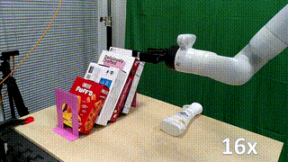
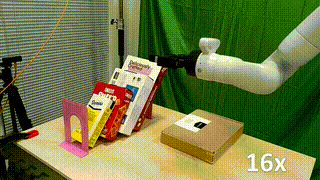
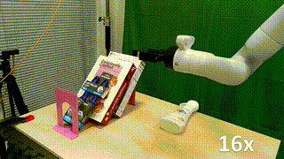
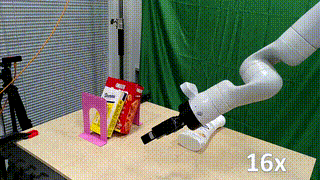

# Predicting Object Interactions with Behavior Primitives: An Application in Stowing Tasks
Haonan Chen, Yilong Niu, Kaiwen Hong, Shuijing Liu, Yixuan Wang, Yunzhu Li, Katherine Driggs-Campbell            

**CoRL 2023, Oral** | [Website](https://stow.github.io/) | [Paper](https://arxiv.org/abs/2309.16118/)


## Demo

### Real-World Demo

  

  


### Our Method


## Prerequisites

- **Operating System**: Ubuntu 20.04.
- **Python**: Version 3.8 is verified.
- **Environment**: robosuiVte-1.2.


## Installation Steps

1. **Create the conda environment**:
    ```bash
    conda env create -f environment.yml
    conda activate stow
    ```

2. **Update .bashrc**:
    ```bash
    echo 'export PYTHONPATH="${PYTHONPATH}:/path/to/stowing"' >> ~/.bashrc
    ```

## Usage

### Dataset Preparation for GNN

1. **Sample and Build Dataset**:
    ```bash
    bash perception/scripts/run_sample.sh [push|sweep|insert]
    ```

2. **Manual Inspection (Optional)**:
    - Consolidate visualizations:
        ```bash
        perception/scripts/inspect_perception.sh
        ```
    - Review videos and record problematic indices in `dump/perception/inspect/inspect.txt`.

3. **Construct GNN Dataset**:
    ```bash
    python perception/scripts/auto_patch_make.py
    ```
### Training the Dynamics Model
You can find our pre-collected dataset [here](https://drive.google.com/drive/folders/1pvQMu6RRAl-iwSlXN0nhyeadwjxN6Fuo?usp=sharing).

Execute the desired script by specifying the task (`push`, `sweep`, or `insert`):
```bash
python dynamics/scripts/hyperparameter_<task>.py
```


## Code Structure

- `config/`: Configuration files for perception and dynamics.
- `dynamics/`: Scripts to train and evaluate the GNN.
- `perception/`: The perception module of Stowing.
- `utils/`: Utilities and visualization functions.


## Citation
If you find our code or paper useful, please cite:
```
@inproceedings{
    chen2023predicting,
    title={Predicting Object Interactions with Behavior Primitives: An Application in Stowing Tasks},
    author={Haonan Chen and Yilong Niu and Kaiwen Hong and Shuijing Liu and Yixuan Wang and Yunzhu Li and Katherine Rose Driggs-Campbell},
    booktitle={7th Annual Conference on Robot Learning},
    year={2023},
    url={https://openreview.net/forum?id=VH6WIPF4Sj}       
}
```


## Acknowledgement
The code is adapted from [RoboCraft](https://github.com/hshi74/robocraft).
